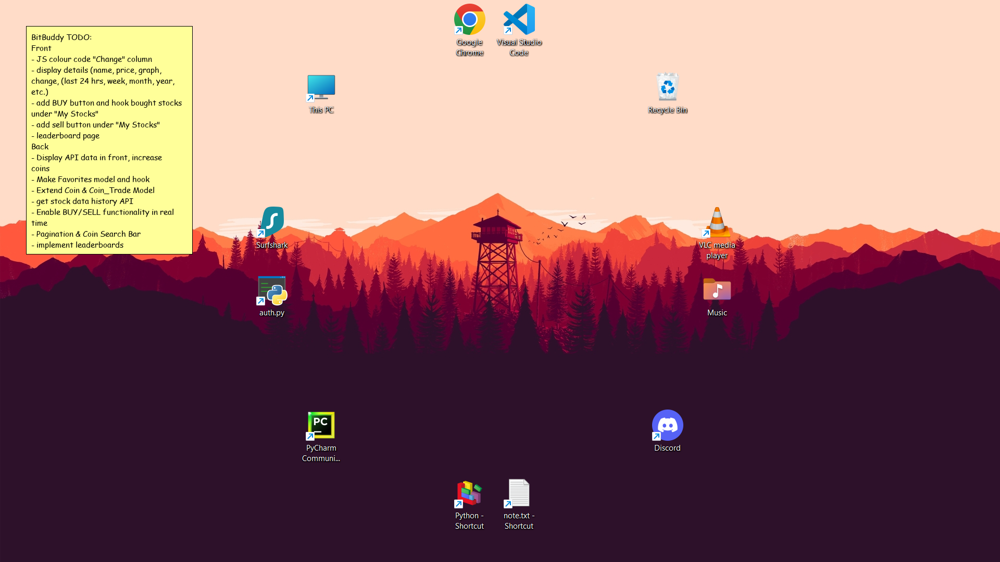

# Wallpaper-Elements
Let your wallpaper be more than just a wallpaper! With Wallpaper Elements, your wallpaper can now be modified to display sticky notes :D
<p align="center">
  
</p>


### Installation

---

#### Clone the repo and install requirements

```bash
git clone https://github.com/Dhanvantg/Wallpaper-Elements.git
cd Wallpaper-Elements
pip install -r requirements.txt
```

#### Create note.txt 

Create a ```note.txt``` file in the folder and keep it handy (possibly a desktop shortcut). Everytime you edit this file, the sticky note is changed automatically

#### Run the script

```bash
python script.py
```

### Automation

---
It gets tiring to run the script everytime on startup and to have a black console window in the background all the time.

#### Create a .exe file

We can package everything into a neat .exe file which runs in the background without the console window open
```bash
pip install pyinstaller
pyinstaller script.py --onefile --noconsole
```
After its done, the executable can be found in ```Scripts/dist``` . Move it elsewhere and delete the generated folders

#### Schedule a Task

Use Windows Task Scheduler to run the file on startup

```Create Basic Task >> Trigger > When the computer starts >> Action > Start a program > Enter script path >> Finish```
